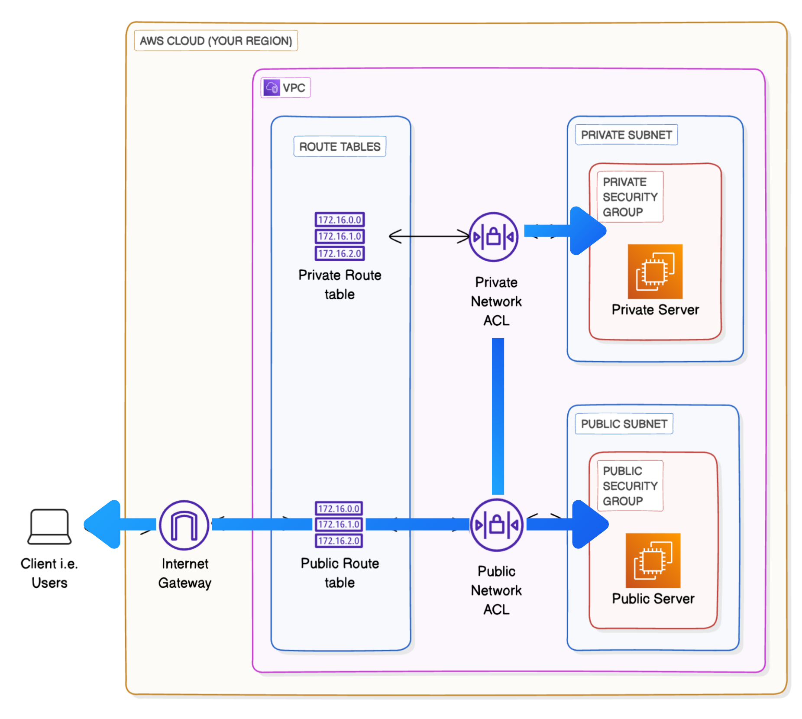
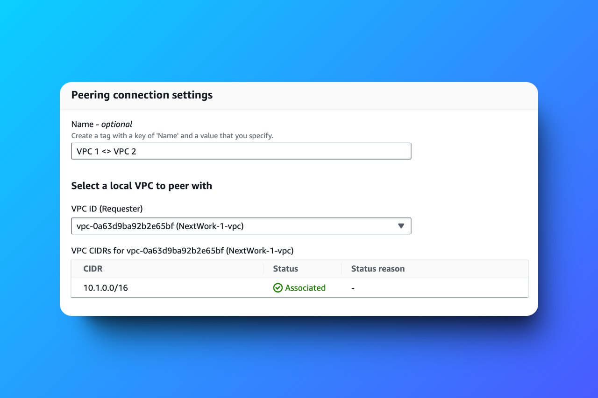
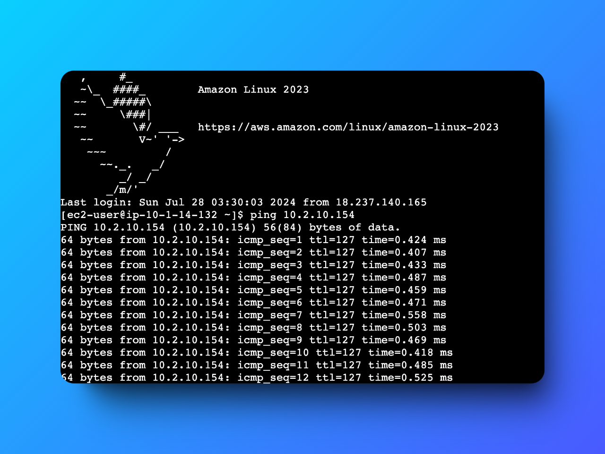

# VPC Peering Project

 
 
 

## Overview
This project demonstrates the creation and configuration of **Amazon VPC Peering**, enabling secure communication between two isolated networks within AWS. The project focuses on VPC setup, peering connections, routing, and connectivity testing, showcasing AWS's networking capabilities for scalable cloud solutions.

---

## Table of Contents
1. [What is Amazon VPC?](#what-is-amazon-vpc)
2. [Project Objectives](#project-objectives)
3. [Project Steps](#project-steps)
4. [Key Learnings](#key-learnings)
5. [Results](#results)
6. [Community and Acknowledgment](#community-and-acknowledgment)
7. [Author](#author)

---

## What is Amazon VPC?
Amazon Virtual Private Cloud (VPC) provides a customizable and isolated network environment within AWS. VPC Peering connects these isolated networks securely, enabling cross-VPC communication without overlapping IP address ranges.

---

## Project Objectives
1. Create two VPCs with unique CIDR blocks.
2. Establish a peering connection between the VPCs.
3. Update routing tables to allow cross-VPC traffic.
4. Validate connectivity through successful communication between instances in each VPC.

---

## Project Steps

### Step 1: VPC Setup
- **Created VPCs:** Configured VPC1 (`10.1.0.0/16`) and VPC2 (`10.2.0.0/16`) with public subnets.
- **Deployed EC2 Instances:** Launched one instance in each VPC and configured appropriate SSH access.

*VPC setup overview.*

---

### Step 2: VPC Peering Connection
- **Peering Request:** Established peering between VPC1 (Requester) and VPC2 (Accepter).
- **Route Table Updates:** Configured route tables to direct cross-VPC traffic via the peering connection.

*Peering connection settings*

---

### Step 3: Connectivity Testing
- **Security Rules Adjustment:** Modified security group rules to allow ICMP (ping) and SSH traffic.
- **Validation:** Conducted successful ping tests between EC2 instances to confirm connectivity.

*Ping results confirming successful cross-VPC communication.*

---

## Key Learnings
1. Importance of accurate CIDR block planning to avoid overlap.
2. The need for precise configuration of security groups and routing tables.
3. Practical experience in troubleshooting connectivity issues in AWS environments.

---

## Results
This project successfully demonstrated VPC peering, with instances in separate VPCs communicating securely. The configuration ensures scalability, flexibility, and robust network design for AWS solutions.

---

## Community and Acknowledgment
Special thanks to [NextWork.org](https://link.nextwork.org/app?utm_source=app&utm_medium=nav&utm_campaign=referral) and mentor **Natasha Ong** for their valuable guidance and insights.

---

## Author
**Hassan Gachoka** [LinkedIn](https://linkedin.com/in/gachokahassan)

